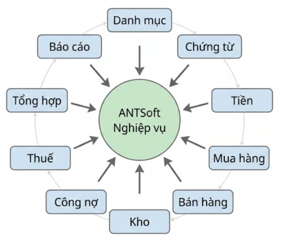

# Giới thiệu tổng quan hệ thống

## <mark style="color:$primary;">**1. ANTSoft là gì?**</mark>

**ANTSoft**, còn được gọi là **VLK Accountin**g, là phần mềm kế toán được phát triển bởi VLK Group, nhằm hỗ trợ doanh nghiệp, kế toán viên, hộ kinh doanh và các đơn vị cung cấp dịch vụ kế toán trong việc quản lý, xử lý và tra cứu dữ liệu kế toán trên một nền tảng thống nhất.

Phần mềm tập trung vào các nghiệp vụ kế toán phổ biến như quản lý chứng từ, danh mục kế toán, tiền, mua hàng, bán hàng, hàng hóa – kho, công nợ, thuế và báo cáo.

**ANTSoft** hướng đến việc đơn giản hóa công việc kế toán, giúp người dùng quản lý dữ liệu tập trung, hạn chế sai sót trong quá trình nhập liệu và thuận tiện trong việc tra cứu, kiểm tra và tổng hợp số liệu.

## <mark style="color:$primary;">**2. Khách hàng đang gặp những vấn đề gì?**</mark>

Trong quá trình thực hiện công tác kế toán, người dùng có thể gặp các nhu cầu về quản lý và kiểm soát dữ liệu như:

* Dữ liệu kế toán cần được quản lý tập trung và nhất quán.
* Khối lượng chứng từ phát sinh lớn, cần tìm kiếm và tra cứu nhanh.
* Cần chuẩn hóa danh mục để hạn chế nhập trùng hoặc sai thông tin.
* Cần theo dõi tiền, mua hàng, bán hàng, kho và công nợ trên cùng một hệ thống.
* Cần quản lý thông tin thuế, hóa đơn và tổng hợp số liệu.
* Cần kiểm tra, đối chiếu và tổng hợp dữ liệu để phục vụ báo cáo.

## <mark style="color:$primary;">**3. ANTSoft giải quyết như thế nào?**</mark>

**ANTSoft** tập trung các nghiệp vụ và dữ liệu kế toán trên một hệ thống thống nhất, hỗ trợ người dùng quản lý dữ liệu xuyên suốt từ phát sinh nghiệp vụ, lập chứng từ, hạch toán, tổng hợp số liệu đến tra cứu và báo cáo.

<table data-header-hidden data-search="false"><thead><tr><th></th><th></th></tr></thead><tbody><tr><td><strong>Nhu cầu</strong></td><td><strong>ANTSoft hỗ trợ</strong></td></tr><tr><td>Quản lý dữ liệu</td><td>Quản lý dữ liệu kế toán tập trung theo từng tổ chức/doanh nghiệp.</td></tr><tr><td>Quản lý chứng từ</td><td>Tạo mới, chỉnh sửa, tìm kiếm, lọc, sắp xếp, nhập khẩu và xuất khẩu chứng từ.</td></tr><tr><td>Chuẩn hóa dữ liệu</td><td>Quản lý các danh mục dùng chung phục vụ nhập liệu và hạch toán.</td></tr><tr><td>Theo dõi nghiệp vụ</td><td>Hỗ trợ tiền, mua hàng, bán hàng, kho và công nợ.</td></tr><tr><td>Quản lý thuế</td><td>Ghi nhận thông tin hóa đơn, thuế GTGT, thuế suất và tiền thuế.</td></tr><tr><td>Tổng hợp và báo cáo</td><td>Hỗ trợ tra cứu, kiểm tra, đối chiếu và tổng hợp số liệu kế toán.</td></tr></tbody></table>

## <mark style="color:$primary;">**4. ANTSoft dành cho ai?**</mark>

| **Đối tượng**                              | **Nhu cầu sử dụng**                                                                                |
| ------------------------------------------ | -------------------------------------------------------------------------------------------------- |
| Kế toán viên                               | Nhập liệu, xử lý chứng từ, hạch toán nghiệp vụ, theo dõi công nợ, kiểm tra số liệu và lập báo cáo. |
| Doanh nghiệp                               | Quản lý dữ liệu kế toán và các nghiệp vụ tài chính phát sinh.                                      |
| Đơn vị cung cấp dịch vụ kế toán            | Quản lý dữ liệu kế toán cho nhiều khách hàng/doanh nghiệp trên cùng hệ thống.                      |
| Chủ doanh nghiệp                           | Tra cứu chứng từ, theo dõi số liệu và xem các báo cáo phục vụ quản lý.                             |
| Hộ kinh doanh và cá nhân hành nghề kế toán | Quản lý và xử lý các nghiệp vụ kế toán phù hợp với nhu cầu sử dụng.                                |

## <mark style="color:$primary;">**5. Hệ sinh thái nghiệp vụ của ANTSoft**</mark>

**ANTSoft** tập trung vào các nhóm nghiệp vụ kế toán cốt lõi, giúp người dùng quản lý dữ liệu xuyên suốt từ chứng từ phát sinh đến tổng hợp số liệu và báo cáo.

<table data-header-hidden data-search="false"><thead><tr><th></th><th></th></tr></thead><tbody><tr><td><strong>Nhóm nghiệp vụ</strong></td><td><strong>Phạm vi hỗ trợ</strong></td></tr><tr><td>Quản lý chứng từ</td><td>Chứng từ tổng hợp, phiếu thu, phiếu chi, phiếu nhập kho, phiếu xuất kho, chứng từ giá vốn và chứng từ kết chuyển.</td></tr><tr><td>Quản lý danh mục</td><td>Tài khoản kế toán, khách hàng, nhà cung cấp, đối tác, hàng hóa, sản phẩm, vật tư, đối tượng hạch toán và các danh mục liên quan.</td></tr><tr><td>Quản lý tiền</td><td>Thu tiền, chi tiền, tiền mặt, tiền gửi ngân hàng và tra cứu, đối chiếu số liệu.</td></tr><tr><td>Mua hàng</td><td>Ghi nhận mua hàng, hóa đơn đầu vào, công nợ phải trả và hàng hóa mua vào.</td></tr><tr><td>Bán hàng</td><td>Ghi nhận bán hàng, hóa đơn đầu ra, doanh thu, giá vốn và công nợ phải thu.</td></tr><tr><td>Hàng hóa và kho</td><td>Nhập kho, xuất kho, theo dõi số lượng, sản phẩm, vật tư, giá vốn và dữ liệu kho.</td></tr><tr><td>Công nợ</td><td>Theo dõi phải thu, phải trả, phát sinh công nợ, thanh toán và đối chiếu công nợ.</td></tr><tr><td>Thuế và hóa đơn</td><td>Thông tin hóa đơn đầu vào/đầu ra, thuế GTGT, thuế suất và tiền thuế.</td></tr><tr><td>Báo cáo</td><td>Báo cáo kế toán, sổ kế toán, báo cáo thuế, báo cáo tài chính và các báo cáo phục vụ quản lý, tra cứu.</td></tr></tbody></table>

## <mark style="color:$success;">**6. Điểm nổi bật của ANTSoft**</mark>

* Quản lý dữ liệu tập trung trên một nền tảng thống nhất.
* Hỗ trợ nhiều nhóm nghiệp vụ kế toán trong cùng hệ thống.
* Chuẩn hóa dữ liệu thông qua hệ thống danh mục dùng chung.
* Hỗ trợ tìm kiếm, lọc, sắp xếp, nhập khẩu và xuất khẩu dữ liệu.
* Thuận tiện tra cứu, kiểm tra và đối chiếu chứng từ, số liệu.
* Hỗ trợ quản lý dữ liệu theo từng tổ chức/doanh nghiệp.
* Hỗ trợ kiểm soát truy cập thông qua tài khoản và quyền người dùng.

## <mark style="color:$primary;">**7. Lợi ích đối với khách hàng**</mark>

<table data-header-hidden data-search="false"><thead><tr><th></th><th></th></tr></thead><tbody><tr><td><strong>Lợi ích</strong></td><td><strong>Giá trị</strong></td></tr><tr><td>Tập trung dữ liệu</td><td>Quản lý dữ liệu kế toán trên một hệ thống thống nhất.</td></tr><tr><td>Tiết kiệm thời gian</td><td>Hỗ trợ các thao tác tìm kiếm, lọc, sắp xếp, nhập khẩu và xuất khẩu dữ liệu.</td></tr><tr><td>Chuẩn hóa nhập liệu</td><td>Sử dụng danh mục và thông tin dùng chung trong quá trình hạch toán.</td></tr><tr><td>Dễ dàng tra cứu</td><td>Truy xuất chứng từ và số liệu khi cần kiểm tra, đối chiếu.</td></tr><tr><td>Hỗ trợ kiểm soát</td><td>Phân quyền người dùng và quản lý dữ liệu theo từng tổ chức/doanh nghiệp.</td></tr><tr><td>Hỗ trợ báo cáo</td><td>Cung cấp dữ liệu phục vụ tổng hợp và lập báo cáo kế toán, thuế và tài chính.</td></tr></tbody></table>

## <mark style="color:$primary;">**8. Báo cáo và quản trị**</mark>

Từ dữ liệu được ghi nhận trên hệ thống, **ANTSoft** hỗ trợ người dùng tra cứu và tổng hợp thông tin phục vụ công tác kế toán.

* Báo cáo kế toán.
* Sổ kế toán.
* Báo cáo thuế.
* Báo cáo tài chính.
* Các báo cáo phục vụ quản lý và tra cứu số liệu.

Người dùng có thể sử dụng dữ liệu trên hệ thống để kiểm tra, đối chiếu và tổng hợp số liệu theo nhu cầu.

## <mark style="color:$primary;">**9. Bảo mật và quản lý dữ liệu**</mark>

**ANTSoft** hỗ trợ quản lý dữ liệu theo từng tổ chức/doanh nghiệp, giúp phân tách dữ liệu giữa các đơn vị sử dụng hệ thống.

Việc truy cập và khai thác dữ liệu được kiểm soát theo tài khoản và quyền của người dùng, góp phần đảm bảo tính bảo mật và an toàn trong quá trình sử dụng phần mềm.

## <mark style="color:$primary;">**10. Tổng quan luồng nghiệp vụ**</mark>

<figure><figcaption></figcaption></figure>

Có thể hình dung luồng xử lý tổng quát trên **ANTSoft** như sau:

**Danh mục → Phát sinh nghiệp vụ → Lập/Nhập chứng từ → Hạch toán → Kiểm tra dữ liệu → Tổng hợp số liệu → Báo cáo**

* **Danh mục:** cung cấp dữ liệu nền phục vụ nhập liệu.
* **Chứng từ:** ghi nhận các nghiệp vụ kinh tế phát sinh.
* **Hạch toán:** phản ánh nghiệp vụ vào các tài khoản kế toán.
* **Dữ liệu kế toán:** được tổng hợp và quản lý trên hệ thống.
* **Báo cáo:** cung cấp thông tin phục vụ kiểm tra, theo dõi và quản lý.

## <mark style="color:$primary;">**11. Thông tin sản phẩm**</mark>

| **Thông tin**     | **Nội dung**                                                                         |
| ----------------- | ------------------------------------------------------------------------------------ |
| Tên sản phẩm      | ANTSoft / VLK Accounting                                                             |
| Đơn vị phát triển | VLK Group                                                                            |
| Đối tượng         | Doanh nghiệp, kế toán viên, hộ kinh doanh và đơn vị cung cấp dịch vụ kế toán         |
| Phạm vi           | Quản lý dữ liệu và các nghiệp vụ kế toán cốt lõi theo phạm vi chức năng của phần mềm |
