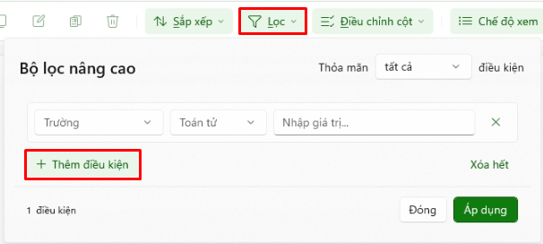

# Chức năng Chứng từ tổng hợp

## <mark style="color:$primary;">Menu các chức năng trong thanh công cụ</mark>

<figure><figcaption></figcaption></figure>

\- Thoát về màn hình chính (Tổng quan) (<mark style="color:red;">**ESC**</mark>)

\- Hiển thị danh sách chứng từ, và các chức năng chính:

#### Thao tác: (<mark style="color:red;">**Phím F1**</mark>)

<figure><figcaption></figcaption></figure>

\+ [Nhập CT mới](readme/chuc-nang-them-moi-chung-tu/) (<mark style="color:red;">**Alt + N**</mark>): Nhập mới một chứng từ vào hệ thống.

\+ [Nạp dữ liệu](readme/chuc-nang-nap-du-lieu/) (<mark style="color:red;">**Alt + I**</mark>): Import file danh sách chứng từ vào hệ thống.

\+ Copy (<mark style="color:red;">**Ctrl + C**</mark>): Copy toàn bộ thông tin của một chứng từ đã chọn

\+ Chỉnh sửa (<mark style="color:red;">**Chọn dữ liệu + Enter**</mark>): Dùng để xem chi tiết chứng từ, hoặc chỉnh sửa các thông tin của chứng từ.


_<mark style="color:$danger;">Lưu ý: chứng từ trong một tháng, khi tháng đó kết thúc thì thông tin các chứng từ đó sẽ được khóa lại không thể chỉnh sửa.</mark>_


\+ Xóa (<mark style="color:red;">**Alt + X**</mark>): Chọn một chứng từ để xóa chứng từ đó.

\+ Sắp xếp (<mark style="color:red;">**Alt + S**</mark>): Chức năng Sắp xếp cho phép người dùng thay đổi thứ tự hiển thị dữ liệu trên danh sách theo một hoặc nhiều tiêu chí, giúp dễ dàng tra cứu, kiểm tra và đối chiếu chứng từ.

<figure><figcaption></figcaption></figure>

\+ Lọc (<mark style="color:red;">**Alt + L**</mark>): Chức năng Lọc cho phép người dùng tìm và hiển thị các chứng từ hoặc dữ liệu đáp ứng một hoặc nhiều điều kiện lọc, giúp nhanh chóng tra cứu thông tin cần thiết trên danh sách.

<figure><figcaption></figcaption></figure>

\+ Tạo bản sao chứng từ đang chọn (<mark style="color:red;">**Ctrl + Shift + C**</mark>): Chọn một chứng từ và coppy ra một bản chứng từ đã chọn.

\+ Điều chỉnh cột hiển thị (<mark style="color:red;">**Alt + D**</mark>): cho phép người dùng tùy chỉnh cách hiển thị các cột dữ liệu trên màn hình danh sách, bao gồm sắp xếp thứ tự cột và ẩn/hiện cột theo nhu cầu sử dụng.

\+ Chế độ xem (<mark style="color:red;">**Alt + V**</mark>): chức năng cho phép người dùng thay đổi cách hiển thị danh sách dữ liệu trên màn hình. Tùy theo nhu cầu làm việc, người dùng có thể lựa chọn hiển thị thông tin ở dạng rút gọn hoặc đầy đủ, đồng thời bật/tắt khung xem trước để theo dõi nội dung nhanh hơn.

<figure><figcaption></figcaption></figure>

\+ Xem chi tiết nhanh một chứng từ (<mark style="color:red;">**Alt + Enter**</mark>): Chọn một chứng từ và mở view xem thông tin chi tiết chứng từ đó, chỉ xem không chỉnh sửa được.

\+ Tick chọn hết (<mark style="color:red;">**Ctrl + A**</mark>): Đánh dấu chọn hết các chứng từ trong danh sách hiển thị.

\+ Bỏ chọn hết (<mark style="color:red;">**Ctrl + Shift + A**</mark>): Bỏ chọn các chứng từ đã đánh dấu chọn

#### Xử lý chứng từ: (<mark style="color:red;">**Phím F2**</mark>)

<figure><figcaption></figcaption></figure>

\+ Ghi sổ/Bỏ ghi sổ: (<mark style="color:red;">**Alt + G**</mark>): Cho phép người dùng chính thức ghi nhận các chứng từ đã được kiểm tra vào hệ thống sổ kế toán. Sau khi ghi sổ, hệ thống tự động cập nhật số liệu vào các tài khoản, công nợ, kho và các báo cáo liên quan, đảm bảo số liệu kế toán được phản ánh đầy đủ và kịp thời.


_<mark style="color:$danger;">Lưu ý: là điều kiện cần để sử dụng chức năng kết chuyển toàn kỳ bên dưới, trường hợp chứng từ đã ghi sổ, người dùng thực hiện chỉnh sửa chứng từ và lưu lại, trạng thái chứng từ sẽ chuyển về thành trạng thái “NHÁP” người dùng cần thực hiện ghi sổ lại.</mark>_


·   Ghi sổ (<mark style="color:red;">**Enter**</mark>)

·   Hủy (<mark style="color:red;">**ESC**</mark>)

\+ Kết chuyển toàn kỳ (<mark style="color:red;">**Alt + K**</mark>): dùng để thực hiện các bút toán tổng hợp vào cuối kỳ kế toán nhằm xác định kết quả hoạt động kinh doanh và chuẩn bị số liệu cho kỳ kế toán tiếp theo.


_<mark style="color:$danger;">Lưu ý: để có thể sử dụng chức năng kết chuyển, chứng từ cần phải được ghi sổ, trạng thái là “đã ghi sổ” ở chức năng ghi sổ trên.</mark>_


\+ Tính lại giá vốn (<mark style="color:red;">**Alt + T**</mark>): là chức năng dùng để hệ thống tính toán lại đơn giá và giá trị hàng xuất kho dựa trên các chứng từ nhập – xuất và phương pháp tính giá vốn đã được thiết lập.

·   Tính lại giá vốn (<mark style="color:red;">**Enter**</mark>)

·   Hủy (<mark style="color:red;">**ESC**</mark>)

\+ Đánh lại số chứng từ (<mark style="color:red;">**Alt + R**</mark>): là chức năng dùng để đánh lại số thứ tự của các chứng từ trong một khoảng thời gian theo quy tắc đánh số đã thiết lập

·   Kiểm tra: (<mark style="color:red;">**Enter**</mark>)

·   Đóng (<mark style="color:red;">**ESC**</mark>)

#### Kết xuất: (<mark style="color:red;">**Ctrl + P**</mark>)

<figure><figcaption></figcaption></figure>

\+ In file (<mark style="color:red;">**Alt + P**</mark>)

·   In phiếu thu (<mark style="color:red;">**Alt + 1**</mark>): thực hiện in phiếu thu của chứng từ đã chọn.

·   In phiếu chi (<mark style="color:red;">**Alt + 2**</mark>): thực hiện in phiếu chi của chứng từ đã chọn.

·   In phiếu nhập (<mark style="color:red;">**Alt + 3**</mark>): thực hiện in phiếu nhập của chứng từ đã chọn.

·   In phiếu xuất (<mark style="color:red;">**Alt + 4**</mark>): thực hiện in phiếu xuất của chứng từ đã chọn.

·   In danh sách chứng từ (<mark style="color:red;">**Alt + A**</mark>): in toàn bộ chứng từ

\+ Xuất file (<mark style="color:red;">**Alt + E**</mark>): xuất danh sách chứng từ ra file.

\+ Gửi email (<mark style="color:red;">**Alt + M**</mark>): gửi danh sách chứng từ qua email

\-    Tìm kiếm (<mark style="color:red;">**Ctrl + F**</mark>): thực hiện tìm kiếm theo nội dung nhập vào để tìm kiếm nhanh chứng từ

\-    Chọn thời gian hiển thị (<mark style="color:red;">**Ctrl + T**</mark>): chọn thời gian hiển thị chứng từ tương ứng.

\-    Gợi ý (<mark style="color:red;">**Phím F12**</mark>): hiển thị khung gợi ý các phím tắt chức năng trong màn hình.

\-    Cấu hình chứng từ (<mark style="color:red;">**Ctrl + H**</mark>): chức năng cho phép doanh nghiệp thiết lập cách thức chứng từ được tạo, nhập liệu, hạch toán và xử lý theo nhu cầu sử dụng.

