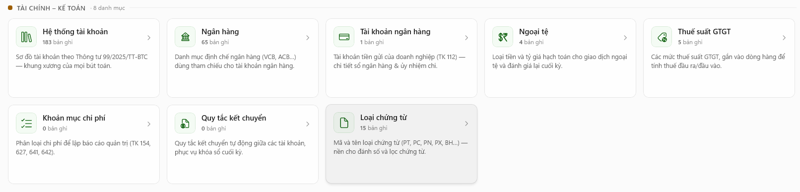
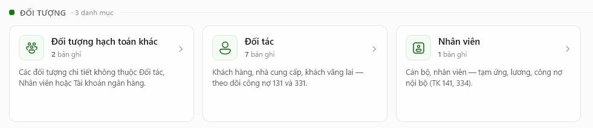
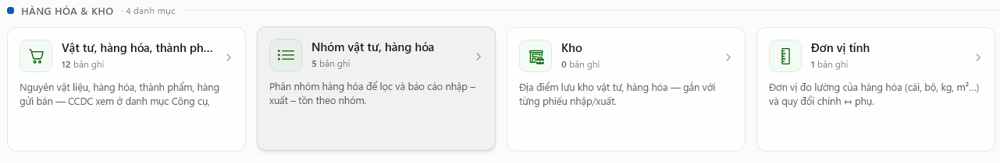
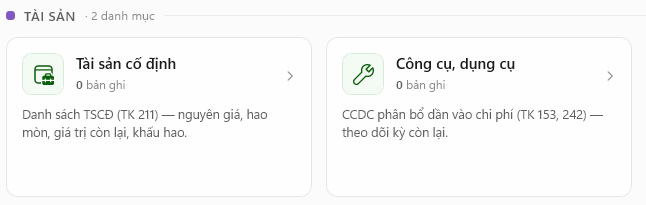
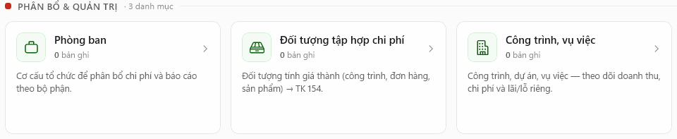

# Danh mục

### <mark style="color:$primary;">Giới thiệu</mark>

\- Danh mục là nơi khai báo, thiết lập và quản lý dữ liệu nền tảng (dữ liệu gốc) dùng chung cho toàn bộ hệ thống:

· **Khởi tạo các dữ liệu chuẩn cần thiết**: Đây là tập hợp các mã quản lý cố định (như mã khách hàng, mã hàng hóa, tài khoản ngân hàng, danh mục phòng ban...). Các dữ liệu này được khởi tạo một lần và sử dụng xuyên suốt toàn bộ phần mềm.

· **Chuẩn hóa & Đồng bộ dữ liệu**: Giúp thống nhất tên gọi, mã số, phương pháp hạch toán và phân loại trên toàn hệ thống, tránh việc mỗi bộ phận tự nhập một kiểu gây sai lệch dữ liệu.

· **Gợi ý & Điền tự động khi hạch toán**: Khi lập chứng từ (như Hóa đơn, Phiếu thu/chi, Phiếu nhập/xuyệt kho), phần mềm sẽ tự động gọi các thông tin đã khai báo trong Danh mục ra để chọn nhanh thay vì phải nhập tay từ đầu.

· **Nền tảng để lên Báo cáo & Phân tích**: Hỗ trợ hệ thống tự động gom nhóm, lọc dữ liệu và tổng hợp báo cáo quản trị (ví dụ: báo cáo công nợ theo Khách hàng, báo cáo tồn kho theo Nhóm hàng, báo cáo chi phí theo Phòng ban...).


<mark style="color:$danger;">Lưu ý: Trước khi sử dụng phần mềm cần vào danh mục khai báo tạo mới các dữ liệu liên quan nhằm phục vụ các nghiệp vụ kế toán trên hệ thống.</mark>


### <mark style="color:$primary;">Có 2 cách để mở màn hình danh mục</mark>

**Cách 1:** Tại màn hình tổng quan, sử dụng phím tắt <mark style="color:red;">**Ctrl + 7**</mark> để vào màn hình Danh mục.

**Cách 2:** Chức năng Danh mục trong thanh công cụ bên trái màn hình.

<figure><figcaption></figcaption></figure>

### <mark style="color:$primary;">Màn hình chức năng danh mục</mark>

<figure><figcaption></figcaption></figure>

<figure><figcaption></figcaption></figure>

### <mark style="color:$primary;">Danh sách các danh mục con quản lý các dữ liệu nền tảng của hệ thống</mark>

#### <mark style="color:blue;">**1. TÀI CHÍNH – KẾ TOÁN**</mark>

<figure><figcaption></figcaption></figure>

\- Danh mục Tài chính – Kế toán là tập hợp các chức năng dùng để khai báo, quản lý và cập nhật các thông tin tài chính, kế toán được sử dụng trong quá trình lập chứng từ, hạch toán và theo dõi số liệu trên phần mềm.

\- Việc thiết lập đầy đủ các danh mục giúp doanh nghiệp chuẩn hóa dữ liệu đầu vào, hỗ trợ nhập liệu nhanh chóng, hạn chế sai sót và đảm bảo số liệu được tổng hợp thống nhất trên sổ sách, báo cáo.

**·** [**Hệ thống tài khoản**](tai-chinh-ke-toan/he-thong-tai-khoan.md)**:** Sơ đồ tài khoản theo Thông tư **99/2025/TT-BTC** — khung xương của mọi bút toán.

**·** [**Ngân hàng**](tai-chinh-ke-toan/ngan-hang.md)**:** Danh mục định chế ngân hàng (**VCB, ACB...**) dùng tham chiếu cho tài khoản ngân hàng.

**·** [**Tài khoản ngân hàng**](tai-chinh-ke-toan/tai-khoan-ngan-hang.md)**:** Tài khoản tiền gửi của doanh nghiệp (**TK 112**) — chi tiết số ngân hàng & ủy nhiệm chi.

**· Ngoại tệ:** Loại tiền và tỷ giá hạch toán cho giao dịch ngoại tệ và đánh giá lại cuối kỳ.

**·** [**Thuế suất GTGT**](tai-chinh-ke-toan/thue-suat-gtgt.md#chuc-nang-tao-moi-du-lieu)**:** Các mức thuế suất GTGT, gắn vào dòng hàng để tính thuế đầu ra/đầu vào.

**· Khoản mục chi phí:** Phân loại chi phí để lập báo cáo quản trị (**TK 154, 627, 641, 642**).

**· Quy tắc kết chuyển:** Quy tắc kết chuyển tự động giữa các tài khoản, phục vụ khóa sổ cuối kỳ.

**· Loại chứng từ:** Mã và tên loại chứng từ (**PT, PC, PN, PX, BH...**) — nền cho đánh số và lọc chứng từ.

#### <mark style="color:blue;">**2. ĐỐI TƯỢNG**</mark>

<figure><figcaption></figcaption></figure>

\- Danh mục Đối tượng là chức năng dùng để khai báo và quản lý các đối tượng phát sinh trong quá trình hoạt động của doanh nghiệp, giúp doanh nghiệp theo dõi chi tiết các nghiệp vụ kế toán theo từng đối tượng.

\- Thông tin từ danh mục Đối tượng được sử dụng khi lập chứng từ, định khoản và theo dõi các khoản phải thu, phải trả, thu – chi, doanh thu, chi phí cũng như các nghiệp vụ kế toán liên quan.

**· Đối tượng hạch toán khác:** Các đối tượng chi tiết không thuộc Đối tác, Nhân viên hoặc Tài khoản ngân hàng.

**· Đối tác:** Khách hàng, nhà cung cấp, khách vãng lai — theo dõi công nợ 131 và 331.

**· Nhân viên:** Cán bộ, nhân viên — tạm ứng, lương, công nợ nội bộ (**TK 141, 334**).

#### <mark style="color:blue;">3. HÀNG HÓA & KHO</mark>

<figure><figcaption></figcaption></figure>

\- Danh mục Hàng hóa và Kho là nhóm chức năng dùng để khai báo, quản lý và theo dõi hàng hóa, vật tư, sản phẩm, dịch vụ và các kho được sử dụng trong hoạt động sản xuất, kinh doanh của doanh nghiệp.

\- Thông tin được khai báo trong danh mục là cơ sở để có thể thực hiện các nghiệp vụ nhập kho, xuất kho, mua hàng, bán hàng, điều chuyển kho, kiểm kê và tính giá vốn trên phần mềm.

**· Vật tư, hàng hóa, thành phẩm:** Nguyên vật liệu, hàng hóa, thành phẩm, hàng gửi bán — CCDC xem ở danh mục <mark style="background-color:$warning;">**Công cụ**</mark>.

**· Nhóm vật tư, hàng hóa:** Phân nhóm hàng hóa để lọc và báo cáo nhập – xuất – tồn theo nhóm.

**· Kho:** Địa điểm lưu kho vật tư, hàng hóa — gắn với từng phiếu nhập/xuất.

**· Đơn vị tính:** Đơn vị đo lường của hàng hóa (**cái, bộ, kg, m²...**) và quy đổi chính sang phụ.

#### <mark style="color:blue;">4. TÀI SẢN</mark>

<figure><figcaption></figcaption></figure>

\- Danh mục Tài sản là chức năng dùng để khai báo, quản lý và theo dõi thông tin các tài sản của doanh nghiệp trong quá trình sử dụng và hạch toán kế toán.

\- Thông tin tài sản được khai báo trong danh mục là cơ sở để thực hiện các nghiệp vụ ghi tăng, ghi giảm, điều chuyển, kiểm kê và tính khấu hao tài sản, đồng thời phục vụ việc theo dõi nguyên giá, giá trị hao mòn và giá trị còn lại của từng tài sản.

**· Tài sản cố định:** Danh sách TSCĐ (**TK 211**) — nguyên giá, hao mòn, giá trị còn lại, khấu hao.

**· Công cụ, dụng cụ:** CCDC phân bổ dần vào chi phí (**TK 153, 242**) — theo dõi kỳ còn lại.

#### <mark style="color:blue;">5. PHÂN BỔ & QUẢN TRỊ</mark>

<figure><figcaption></figcaption></figure>

\- Danh mục Phân bổ và Quản trị là nhóm chức năng dùng để thiết lập và quản lý các thông tin phục vụ việc phân bổ chi phí, doanh thu và quản lý hoạt động kế toán theo từng đối tượng, bộ phận hoặc mục đích sử dụng. Danh mục này giúp doanh nghiệp tổ chức dữ liệu kế toán một cách thống nhất, hỗ trợ hệ thống tự động xác định nơi nhận chi phí/doanh thu và phục vụ việc tổng hợp, phân tích báo cáo.

\- Các thông tin được khai báo trong danh mục là cơ sở để hệ thống sử dụng khi lập chứng từ, phân bổ chi phí, tính giá thành và tổng hợp số liệu.

**· Phòng ban:** Cơ cấu tổ chức để phân bổ chi phí và báo cáo theo bộ phận.

**· Đối tượng tập hợp chi phí:** Đối tượng tính giá thành (**công trình, đơn hàng, sản phẩm**) -> **TK 154**.

**· Công trình, vụ việc:** Công trình, dự án, vụ việc — theo dõi doanh thu, chi phí và lãi/lỗ riêng.
