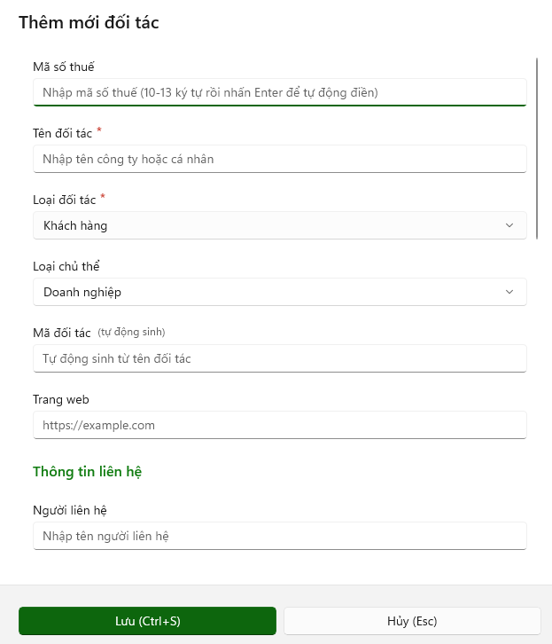

# Đối tác

### <mark style="color:$primary;">Màn hình chức năng</mark>

<figure><figcaption></figcaption></figure>

\- Danh mục đối tác đóng vai trò là dữ liệu dùng chung cho nhiều nghiệp vụ. Khi lập chứng từ mua hàng, bán hàng, thu tiền, chi tiền hoặc theo dõi công nợ, có thể lựa chọn đối tác đã được khai báo thay vì phải nhập lại thông tin nhiều lần. Là nơi quản lý tập trung “đối tác của doanh nghiệp là ai và thông tin liên hệ của họ là gì”, làm cơ sở để sử dụng xuyên suốt các nghiệp vụ kế toán và quản lý công nợ.

**Ví dụ:** Khi lập hóa đơn bán hàng, chọn khách hàng Công ty TNHH ABC từ Danh mục đối tác. Hệ thống có thể tự động lấy các thông tin đã khai báo như mã số thuế, địa chỉ, người liên hệ..., giúp giảm thời gian nhập liệu và hạn chế sai sót.

### <mark style="color:$primary;">Các chức năng trong danh mục thuế suất GTGT</mark>

**1. Tác vụ chung (**<mark style="color:red;">**Ctrl + U**</mark>**)**

**+ Tạo mới (**<mark style="color:red;">**Alt + N**</mark>**):**

**+ Nạp dữ liệu (**<mark style="color:red;">**Alt + I**</mark>**):**

**+ Chỉnh sửa (**<mark style="color:red;">**Chọn dữ liệu + Enter**</mark>**):** Dùng để xem chi tiết thông tin đối tác, hoặc chỉnh sửa các thông tin của đối tác đã chọn.

**+ Xóa (**<mark style="color:red;">**Alt + X**</mark>**):** Xóa đối tác đã chọn.

**+ Sắp xếp (**<mark style="color:red;">**Alt + S**</mark>**):** Chức năng Sắp xếp dùng để thay đổi thứ tự hiển thị dữ liệu trên danh sách theo một hoặc nhiều tiêu chí, giúp dễ dàng tra cứu, kiểm tra và đối chiếu dữ liệu.

**· Thêm điều kiện (**<mark style="color:red;">**Alt + N**</mark>**)**

**· Xóa tất cả điều kiện (**<mark style="color:red;">**Alt + Delete**</mark>**)**

**· Xóa một điều kiện (**<mark style="color:red;">**Alt + X**</mark>**)**

**· Đóng (**<mark style="color:red;">**ESC**</mark>**)**

**· Áp dụng (**<mark style="color:red;">**Alt + A**</mark>**)**

**+ Lọc (**<mark style="color:red;">**Alt + L**</mark>**):** Chức năng Lọc dùng để tìm và hiển thị các dữ liệu đáp ứng một hoặc nhiều điều kiện lọc, giúp nhanh chóng tra cứu thông tin cần thiết trên danh sách.

**· Thêm điều kiện (**<mark style="color:red;">**Alt + N**</mark>**)**

**· Xóa tất cả điều kiện (**<mark style="color:red;">**Alt + Delete**</mark>**)**

**· Xóa một điều kiện (**<mark style="color:red;">**Alt + X**</mark>**)**

**· Đóng (**<mark style="color:red;">**ESC**</mark>**)**

**· Áp dụng (**<mark style="color:red;">**Alt + A**</mark>**)**

**+ Điều chỉnh cột hiển thị (**<mark style="color:red;">**Alt + D**</mark>**):** dùng để tùy chỉnh cách hiển thị các cột dữ liệu trên màn hình danh sách, bao gồm sắp xếp thứ tự cột và ẩn/hiện cột theo nhu cầu sử dụng.

**· Hiện/đóng tất cả: (**<mark style="color:red;">**Ctrl + A**</mark>**)**

**· Đóng (**<mark style="color:red;">**ESC**</mark>**)**

**· Áp dụng (**<mark style="color:red;">**Alt + A**</mark>**)**

**+ Tìm kiếm nhanh (**<mark style="color:red;">**Ctrl + F**</mark>**):** thực hiện tìm kiếm theo nội dung nhập vào để tìm kiếm nhanh dữ liệu.

**+ Làm mới dữ liệu (**<mark style="color:red;">**Phím F5**</mark>**):** Dùng để làm mới dữ liệu hiển thị để cập nhật những thay đổi mới nhất khi chỉnh sửa dữ liệu nhưng chưa được hiển thị các thông tin đã chỉnh sửa.

**+ Ẩn thanh chi tiết (**<mark style="color:red;">**Alt + V**</mark>**):** Chọn một đối tượng và mở view xem nhanh thông tin chi tiết đối tác đó. Và thực hiện phím tắt để ẩn thanh chi tiết.

**2. In ấn và chia sẻ (**<mark style="color:red;">**Ctrl + P**</mark>**)**

**+ In (**<mark style="color:red;">**Alt + P**</mark>**):** Thực hiện in dữ liệu

**+ Xuất file excel (**<mark style="color:red;">**Alt + E**</mark>**):** xuất danh sách dữ liệu ra file excel.

### <mark style="color:$primary;">Chức năng tạo mới dữ liệu</mark>

<figure><figcaption></figcaption></figure> <figure><figcaption></figcaption></figure>

**Nhóm thông tin đối tác:**

* **Mã số thuế:** Nhập vào mã số thuế đối tác. Khi nhập xong bấm Enter để lấy thông tin dựa trên mã số thuế để điền xuống các trường thông tin bên dưới.
* **Tên đối tác (**<mark style="color:red;">**bắt buộc**</mark>**):** Nhập vào hoặc tự động điền khi nhập mã số thuế.
* **Loại đối tác (**<mark style="color:red;">**bắt buộc**</mark>**):** Chọn loại đối tác phù hợp để phân loại khách hàng hoặc nhà cung cấp.
* **Loại chủ thể:** Chọn loại chủ thể để xác định đối tượng tham gia giao dịch.
* **Mã đối tác:** Là mã định danh duy nhất của một đối tượng giao dịch trong hệ thống.
* **Trang web:** Thông tin trang web công ty đối tác.

**Thông tin liên hệ:**

* **Người liên hệ:** Tên người đại diện của đối tác.
* **Email:** Email người đại diện.
* **Số điện thoại:** Số điện thoại người đại diện.

**Địa chỉ của công ty đối tác:**

* **Địa chỉ đầy đủ:** Địa chỉ sẽ được tự động điền khi nhập mã số thuế hoặc có thể tự nhập lại địa chỉ chi tiết.
* **Phường/Xã:** Nhập vào địa chỉ phường/xã của đối tác.
* **Tỉnh/thành phố:** Nhập vào địa chỉ tỉnh/thành phố của đối tác.
* **Quốc gia:** Nhập vào quốc gia của đối tác.
* **Mã bưu chính:** Nhập vào mã bưu chính của đối tác.

**Thông tin ngân hàng:**

* **Tên ngân hàng:** Nhập vào tên ngân hàng của đối tác.
* **Chi nhánh:** Nhập vào chi nhánh ngân hàng vừa nhập.
* **Số tài khoản:** Nhập vào số tài khoản đối tác.

**Thông tin bổ sung:**

* **Ngày thành lập:** Ngày thành lập công ty của đối tác.
* **Trạng thái:** Trạng thái hoạt động của công ty đối tác. Nếu không hoạt động sẽ không hiển thị cho chọn trong thêm mới chứng từ.
* Sau khi nhập xong các thông tin, **Lưu (**<mark style="color:red;">**Ctrl + S**</mark>**)** hoặc **Hủy (**<mark style="color:red;">**ESC**</mark>**).**

### <mark style="color:$primary;">**Chức năng Nạp dữ liệu**</mark>

<figure><figcaption></figcaption></figure>

#### **Để thực hiện nạp dữ liệu gồm có 3 bước:**

1: Chọn dữ liệu -> 2: Gắn cột dữ liệu -> 3: Kiểm tra &#x26; Lưu

#### **Bước 1: Chọn dữ liệu & cấu hình**

**Điều kiện để nạp dữ liệu:** Chuẩn hóa dữ liệu file import.

<figure><figcaption></figcaption></figure>

* Chọn loại dữ liệu để hiển thị ra file mẫu import phù hợp với loại import.
* Tải file mẫu về **(**<mark style="color:red;">**Alt + M**</mark>**)**, chuẩn hóa lại dữ liệu từng cột trong file dữ liệu đã chuẩn bị sẵn sang các cột tương ứng trong file mẫu đã tải.
* Có thể không cần chuẩn hóa trước, vẫn có thể import, nhưng sẽ phải gán lại cột dữ liệu tương ứng ở bước “Gán cột dữ liệu”. Phần này sẽ mất thời gian để chọn từng loại dữ liệu phù hợp với cột dữ liệu truyền vào.

<figure><figcaption></figcaption></figure>

**Đính kèm file import**

<figure><figcaption></figcaption></figure>

Sau khi chuẩn hóa dữ liệu theo file import mẫu, có thể sử dụng các cách sau để đính kèm file:

* Kéo thả file vào khung import.
* Click nút **“Chọn file”** (<mark style="color:red;">**Alt + E**</mark>) để mở hộp thoại folder, sau đó tìm đến folder chứa file và chọn file đã chuẩn hóa.

Nếu muốn thay đổi file đã đính, click vào nút **“Chọn file khác”** (<mark style="color:red;">**Alt + E**</mark>).

* **Nút tiếp theo: (**<mark style="color:red;">**Alt + T**</mark>**)**
* **Nút hủy: (**<mark style="color:red;">**ESC**</mark>**)**

**Cấu hình chi tiết đối tác**

<figure><figcaption></figcaption></figure>

\- Sau khi đính kèm file import hệ thống sẽ hiện bảng cấu hình chi tiết đối tác.

**Chọn các chế độ lưu:**

**+ Thêm mới:** Chỉ tạo các bản ghi mới. Các dòng trùng với dữ liệu đã có sẽ bị từ chối.

**+ Cập nhật:** Chỉ cập nhật các bản ghi đã tồn tại trong CSDL. Các dòng chưa có sẽ bị từ chối.

**+ Ghi đè:** Tạo mới nếu chưa có, cập nhật nếu đã tồn tại. Chế độ linh hoạt nhất.

**+ Ghi đè toàn bộ:** Ghi đè tất cả các trường, kể cả trường không được gán cột. Chỉ khả dụng cho một số loại dữ liệu.

**Chọn Tự sinh mã đối tác:** tự động sinh mã đối tác nếu trong file import không có mã đối tác.

#### Bước 2: Gán dữ liệu

<figure><figcaption></figcaption></figure>

Thực hiện kiểm tra các cột dữ liệu để import.

**Các cột thông tin hiển thị dữ liệu:**

* **Cột trường thông tin:** Hiển thị các thông tin cần thiết để import vào hệ thống; các trường dữ liệu quan trọng sẽ được đánh dấu sao bắt buộc.
* **Cột chứa dữ liệu:** Chọn thông tin tương ứng với thông tin của “Cột trường thông tin”; các thông tin được chọn là các cột trong file mà hệ thống kiểm tra được.
* **Cột dữ liệu mẫu:** Gợi ý mẫu dữ liệu nạp vào theo cột.
* **Cột mô tả:** Mô tả ý nghĩa của trường dữ liệu.

**Các chức năng:**

* **Nút tiếp theo: (**<mark style="color:red;">**Alt + T**</mark>**)**
* **Nút hủy: (**<mark style="color:red;">**ESC**</mark>**)**
* **Quay về bước trước: (**<mark style="color:red;">**Alt + Q**</mark>**)**
* **Hiển thị trường không bắt buộc (**<mark style="color:red;">**Alt + V**</mark>**)**

#### Bước 3: Kiểm tra & Lưu

<figure><figcaption></figcaption></figure>

**Các chức năng trên thanh công cụ**

* **Quay về bước trước** (<mark style="color:red;">**Alt + Q**</mark>).
* **Lưu dữ liệu** (<mark style="color:red;">**Ctrl + S**</mark>): Thực hiện import danh sách chứng từ vào hệ thống.
* **Chạy xác thực** (<mark style="color:red;">**F5**</mark>): Click chọn chức năng để thực hiện kiểm tra, rà soát lại các chứng từ nhập vào xem hợp lệ hay chưa. Nếu chưa, hệ t hống sẽ cảnh báo ở bên phải màn hình, mục **“Kết quả xác thực”**.
* **Hủy** (<mark style="color:red;">**ESC**</mark>): Dùng để thoát khỏi chức năng **“Nạp dữ liệu”**.
* **Lọc** (<mark style="color:red;">**Alt + L**</mark>): Dùng để lọc chứng từ theo các trường hợp: hợp lệ, có lỗi, để hiển thị danh sách các chứng từ theo điều kiện.
* **Tìm** (<mark style="color:red;">**Ctrl + F**</mark>): Tìm chứng từ theo thông tin nhập vào.
* **Chọn toàn bộ dữ liệu (**<mark style="color:red;">**Ctr + A**</mark>**)** để chọn tất cả các dữ liệu trong danh sách để lưu.

