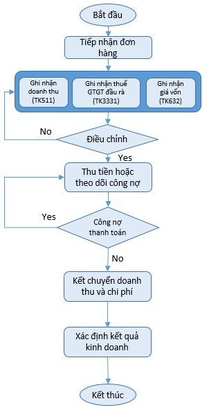

# Kho

<figure><figcaption></figcaption></figure>

#### <mark style="color:blue;">Giới thiệu</mark>

* **Nhập kho:** Ghi nhận hàng mua, nguyên vật liệu hoặc thành phẩm hoàn thành.
* **Xuất kho hoặc điều chuyển:** Cập nhật giảm tồn kho tại kho xuất.
* **Kiểm kê:** Đối chiếu tồn kho thực tế với số liệu sổ sách.
* **Xử lý chênh lệch:** Ghi nhận điều chỉnh sau khi kiểm kê.
* **Nghiệp vụ kho là quá trình ghi nhận và quản lý:**
  * Nhập kho hàng hóa, nguyên vật liệu, thành phẩm.
  * Xuất kho để bán hoặc sản xuất.
  * Điều chuyển giữa các kho.
  * Kiểm kê và xử lý chênh lệch tồn kho.
  * Theo dõi số lượng và giá trị hàng tồn kho.

#### <mark style="color:blue;">Mục đích của nghiệp vụ kho</mark>

* Hàng hóa được quản lý chính xác về số lượng và giá trị.
* Số liệu giữa kho thực tế và sổ kế toán luôn khớp.
* Cung cấp thông tin phục vụ quản trị và lập báo cáo tài chính.

#### <mark style="color:blue;">Danh sách một số nghiệp vụ về bán hàng</mark>

<table data-header-hidden data-search="false"><thead><tr><th></th><th></th><th></th></tr></thead><tbody><tr><td><strong>Nghiệp vụ</strong></td><td><strong>Vai trò</strong></td><td><strong>Định khoản</strong></td></tr><tr><td>Mua hàng nhập kho chưa thanh toán</td><td>Ghi tăng hàng tồn kho, ghi nhận thuế GTGT đầu vào được khấu trừ (nếu đủ điều kiện) và phát sinh công nợ phải trả nhà cung cấp.</td><td>Nợ TK 156/152 Nợ TK 1331 Có TK 331</td></tr><tr><td>Mua hàng nhập kho thanh toán bằng tiền mặt</td><td>Ghi tăng hàng tồn kho và giảm tiền mặt.</td><td>Nợ TK 156/152 Nợ TK 1331 Có TK 111</td></tr><tr><td>Mua hàng nhập kho thanh toán qua ngân hàng</td><td>Ghi tăng hàng tồn kho và giảm tiền gửi ngân hàng.</td><td>Nợ TK 156/152 Nợ TK 1331 Có TK 112</td></tr><tr><td>Hàng mua đang đi đường khi nhận hóa đơn</td><td>Ghi nhận quyền sở hữu hàng hóa chưa nhập kho thực tế</td><td>Nợ TK 151 Nợ TK 1331 Có TK 331</td></tr><tr><td>Hàng mua đang đi đường đã về kho</td><td>Chuyển giá trị hàng từ TK 151 sang hàng tồn kho khi hàng đã nhập kho.</td><td>Nợ TK 156/152 Có TK 151</td></tr><tr><td>Xuất kho bán hàng</td><td>Ghi nhận giá vốn hàng bán và giảm hàng hóa trong kho.</td><td>Nợ TK 632 Có TK 156</td></tr><tr><td>Xuất nguyên vật liệu cho sản xuất</td><td>Tập hợp chi phí nguyên vật liệu trực tiếp phục vụ sản xuất</td><td>Nợ TK 621 Có TK 152</td></tr><tr><td>Xuất nguyên vật liệu dùng cho quản lý phân xưởng</td><td>Ghi nhận chi phí sản xuất chung</td><td>Nợ TK 627 Có TK 152</td></tr><tr><td>Nhập kho thành phẩm hoàn thành</td><td>Kết chuyển chi phí sản xuất dở dang sang thành phẩm khi hoàn thành sản xuất.</td><td>Nợ TK 155 Có TK 154</td></tr><tr><td>Xuất công cụ dụng cụ dùng một lần</td><td>Ghi nhận ngay toàn bộ giá trị công cụ dụng cụ vào chi phí của bộ phận sử dụng.</td><td>Nợ TK 627/641/642 Có TK 153</td></tr><tr><td>Xuất công cụ dụng cụ phân bổ nhiều lần</td><td>Chuyển giá trị công cụ dụng cụ sang chi phí trả trước để phân bổ dần.</td><td>Nợ TK 242 Có TK 153</td></tr><tr><td>Nhập lại hàng bán bị trả lại</td><td>Tăng hàng tồn kho và giảm giá vốn đã ghi nhận.</td><td>Nợ TK 156 Có TK 632</td></tr></tbody></table>
