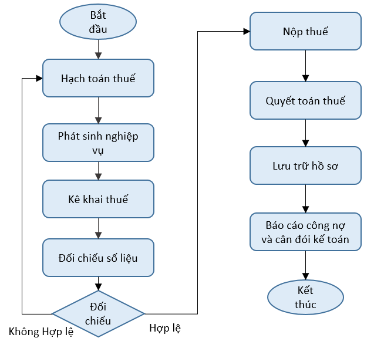

# Thuế

<figure><figcaption></figcaption></figure>

#### <mark style="color:blue;">Giới thiệu</mark>

Nghiệp vụ thuế là một quy trình quản lý xuyên suốt từ ghi nhận hóa đơn, hạch toán thuế, kê khai, nộp thuế đến lưu trữ hồ sơ và quyết toán thuế. Thực hiện đúng nghiệp vụ thuế giúp doanh nghiệp tuân thủ pháp luật, giảm thiểu rủi ro về thuế và đảm bảo số liệu kế toán chính xác, minh bạch.

#### <mark style="color:blue;">Doanh nghiệp quản lý nghiệp vụ thuế nhằm</mark>

* Thực hiện đúng nghĩa vụ với Nhà nước.
* Kê khai thuế đầy đủ, chính xác và đúng hạn.
* Hạn chế rủi ro về thuế, xử phạt và truy thu.
* Kiểm soát thuế GTGT đầu vào, đầu ra.
* Xác định đúng chi phí và lợi nhuận.
* Cung cấp số liệu chính xác cho báo cáo tài chính và báo cáo thuế.

#### <mark style="color:blue;">Danh sách một số nghiệp vụ liên quan đến thuế</mark>

<table data-header-hidden data-search="false"><thead><tr><th></th><th></th><th></th></tr></thead><tbody><tr><td><strong>Nghiệp vụ</strong></td><td><strong>Vai trò</strong></td><td><strong>Định khoản</strong></td></tr><tr><td>Hạch toán thuế GTGT đầu vào được khấu trừ</td><td>Ghi nhận, lập tờ khai và thực hiện khấu trừ thuế giá trị gia tăng (GTGT) đầu vào trên phần mềm, đảm bảo tuân thủ đúng quy trình kế toán và pháp luật thuế.</td><td>Nợ TK 152, 153, 156, 211, 213, 611… Nợ TK 133 Thuế GTGT được khấu trừ Có các TK 111, 112, 331… Tổng giá thanh toán</td></tr><tr><td>Xác định thuế GTGT đầu ra</td><td>Xác định đầu ra trên phần mềm, đảm bảo tuân thủ đúng quy trình kế toán và pháp luật thuế.</td><td>Nợ TK 111, 112, 131… Tổng giá thanh toán Có TK 33311 Thuế GTGT đầu ra Có TK 511</td></tr><tr><td>Xác định số thuế GTGT được khấu trừ với số thuế GTGT đầu ra và số thuế GTGT phải nộp trong kỳ</td><td>Cuối tháng, kế toán tính, xác định số thuế GTGT được khấu trừ với số thuế GTGT đầu ra và số thuế GTGT phải nộp trong kỳ</td><td>Nợ TK 33311 Thuế GTGT đầu ra Có TK 133 Thuế GTGT được khấu trừ</td></tr><tr><td>Hạch toán khi mua hàng</td><td>Lập tờ khai thuế GTGT trực tiếp trên doanh thu khi mua hàng</td><td>Nợ TK 152, 153, 156, 211, 213, 611… (Giá trị bao gồm cả thuế GTGT) Có các TK 111, 112, 331… Tổng giá thanh toán</td></tr><tr><td>Hạch toán khi bán hàng</td><td>Lập tờ khai thuế GTGT trực tiếp trên doanh thu khi bán hàng</td><td>Nợ TK 111, 112, 131… Tổng giá thanh toán Có TK 511, 512…</td></tr><tr><td>Xác định số thuế GTGT phải nộp trong kỳ</td><td>Cuối tháng, kế toán tính, xác định số thuế GTGT phải nộp trong kỳ</td><td>Nợ TK 511 Có TK 33311 Thuế GTGT phải nộp</td></tr><tr><td>Xác định số thuế Thu nhập doanh nghiệp</td><td>Hàng quý, doanh nghiệp xác định số thuế Thu nhập doanh nghiệp tạm nộp</td><td>Nợ TK 8211 Chi phí thuế TNDN hiện hành Có TK 3334 Thuế thu nhập doanh nghiệp</td></tr><tr><td>Xác định số thuế thu nhập doanh nghiệp phải nộp của năm tài chính</td><td>Cuối năm xác định số thuế thu nhập doanh nghiệp phải nộp của năm tài chính</td><td><strong>Nếu thuế TNDN thực tế phải nộp &#x3C; thuế TNDN tạm nộp hàng quý trong năm:</strong> Nợ TK 3334 Thuế thu nhập doanh nghiệp Có TK 8211 Chi phí thuế TNDN hiện hành  <strong>Nếu số TNDN thực tế phải nộp > thuế TNDN tạm nộp hàng quý trong năm:</strong> Nợ TK 8211 Chi phí thuế TNDN hiện hành Có TK 3334 Thuế thu nhập doanh nghiệp</td></tr><tr><td>Thuế tài nguyên</td><td>Thuế tài nguyên là khoản thu ngân sách nhà nước đánh vào giá trị tài nguyên thiên nhiên được khai thác</td><td>Nợ TK 6278 Chi phí bằng tiền khác Có TK 3336 Thuế tài nguyên</td></tr><tr><td>Thuế tiêu thụ đặc biệt trong kỳ</td><td>Xác định số thuế tiêu thụ đặc biệt đã được xác định tiêu thụ trong kỳ</td><td>Nợ TK 511, 512… Có TK 3332 Thuế tiêu thụ đặc biệt</td></tr><tr><td>Thuế tiêu thụ đặc biệt của hàng nhập khẩu</td><td>Hạch toán thuế tiêu thụ đặc biệt của hàng nhập khẩu</td><td>Nợ TK 152, 156, 211, 611 Có TK 3332 Thuế tiêu thụ đặc biệt Có TK 511 Doanh thu bán hàng</td></tr><tr><td>Thuế tiêu thụ đặc biệt</td><td>Loại thuế gián thu đánh vào một số hàng hóa, dịch vụ đặc biệt mà Nhà nước cần điều tiết về tiêu dùng hoặc quản lý chặt chẽ.</td><td>Nợ TK 3332 Thuế tiêu thụ đặc biệt Có TK 111, 112 Tiền mặt, tiền gửi</td></tr><tr><td>Khấu trừ thuế Thu nhập cá nhân của công nhân viên</td><td>Hàng tháng/quý, doanh nghiệp khấu trừ thuế Thu nhập cá nhân của công nhân viên</td><td>Nợ TK 3341 Phải trả công nhân viên Có TK 3335 Thuế thu nhập cá nhân</td></tr><tr><td>Nộp thuế TNCN vào Ngân sách nhà nước</td><td>Thực hiện nghĩa vụ chuyển số tiền thuế đã được tính toán, khấu trừ vào kho bạc nhà nước theo quy định của pháp luật</td><td>Nợ TK 3335 Thuế thu nhập cá nhân Có TK 111/112 Tiền mặt/Tiền gửi ngân hàng</td></tr><tr><td>Quyết toán thuế TNCN</td><td>Cuối năm, thực hiện quyết toán thuế TNCN. Nếu phát sinh số thuế TNCN được hoàn</td><td>Nhận tiền hoàn thuế TNCN: Nợ TK 111/112 Tiền mặt/Tiền gửi ngân hàng Có TK 3388 Phải trả khác  <strong>Trả tiền hoàn thuế cho công nhân viên:</strong> Nợ TK 3388 Phải trả khác Có TK 111/112 Tiền mặt/Tiền gửi ngân hàng</td></tr></tbody></table>
