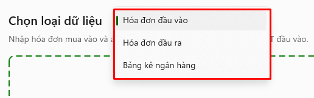
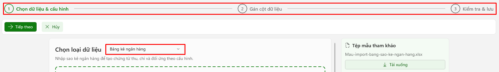
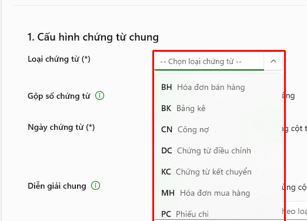
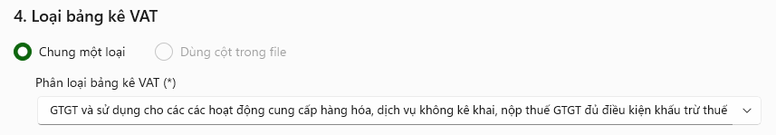
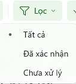

# II. Quy trình import “Hóa đơn đầu vào” và “Hóa đơn đầu ra”

<figure><figcaption></figcaption></figure>

1: Chọn dữ liệu -> 2: Gắn cột dữ liệu -> 3: Đối chiếu hàng hóa -> 4: Kiểm tra &#x26; Lưu



### <mark style="color:blue;">Bước 1: Chọn dữ liệu & cấu hình</mark>

**Điều kiện để nạp dữ liệu:** Chuẩn hóa dữ liệu file import.

* Chọn loại dữ liệu để hiển thị ra file mẫu import phù hợp với loại import.
* Người dùng tải file mẫu về (<mark style="color:red;">**Alt + M**</mark>), chuẩn hóa lại dữ liệu từng cột trong file dữ liệu đã chuẩn bị sẵn sang các cột tương ứng trong file mẫu đã tải.
* Người dùng có thể không cần chuẩn hóa trước, vẫn có thể import, nhưng sẽ phải gán lại cột dữ liệu tương ứng ở bước **“Gán cột dữ liệu”**. Phần này sẽ mất thời gian để chọn từng loại dữ liệu phù hợp với cột dữ liệu truyền vào.


Khuyến khích việc chuẩn hóa trước file dữ liệu để tiết kiệm thời gian và tránh sai sót thông tin khi bước vào bước **“Gán cột dữ liệu”**.


<figure><figcaption></figcaption></figure>

#### **Cấu hình nhanh**

<figure><figcaption></figcaption></figure>

* Người dùng cấu hình nhanh loại dữ liệu import vào (<mark style="color:red;">**Alt + C**</mark>).
* Tùy theo loại dữ liệu import vào sẽ có mỗi quy trình khác nhau.
* Đối với loại import chọn là **“Bảng kê ngân hàng”**, quy trình sẽ rút ngắn lại chỉ còn 3 bước và không có bước số 3 **“Đối chiếu hàng hóa”**.

<figure><figcaption></figcaption></figure>

#### Đính kèm file import

Sau khi chuẩn hóa dữ liệu theo file import mẫu, người dùng có thể sử dụng các cách sau để đính kèm file:

* Kéo thả file vào khung import.
* Click nút **“Chọn file”** (<mark style="color:red;">**Alt + E**</mark>) để mở hộp thoại folder, sau đó tìm đến folder chứa file và chọn file đã chuẩn hóa.

Nếu người dùng muốn thay đổi file đã đính, click vào nút **“Chọn file khác”** (<mark style="color:red;">**Alt + E**</mark>).

* Nút tiếp theo: (<mark style="color:red;">**Alt + T**</mark>)
* Nút hủy: (<mark style="color:red;">**ESC**</mark>)

#### Cấu hình chi tiết

**1) Cấu hình chứng từ chung**

* **Loại chứng từ:** Chọn loại chứng từ trong danh sách hiển thị sẵn.

<figure><figcaption></figcaption></figure>

* **Gộp số chứng từ:** Tick chọn loại gộp.

<figure><figcaption></figcaption></figure>

* **Ngày chứng từ:** Chọn loại ngày.

\+ Dùng ngày cụ thể: Khi chọn sẽ hiển thị ô nhập ngày cụ thể.

\+ Dùng cột trong file: Hệ thống sẽ lấy cột ngày trong file.

\+ Dùng cột ngày hóa đơn: Hệ thống sẽ lấy ngày theo ngày của hóa đơn.

* **Diễn giải chung:**

<figure><figcaption></figcaption></figure>

* **Dùng mẫu diễn giải:** Khi chọn sẽ hiện khung nhập vào nội dung hoặc chọn các gợi ý có sẵn.
* **Dùng cột trong file:** Sử dụng diễn giải trong file import.

**2) Định khoản mặc định**

<figure><figcaption></figcaption></figure>

* **Dùng mặc định:** Khi chọn sẽ hiện các tài khoản kế toán cần chọn để định khoản.
* **Dùng cột trong file:** Sử dụng cột định khoản trong file import.

**3) Nguồn dữ liệu số tiền**

<figure><figcaption></figcaption></figure>

* **Số tiền:** Dùng cột trong file import hoặc tính tự động để kiểm tra và tính số tiền các cột trong file.
* **Tiền thuế:** Dùng cột trong file import hoặc tính tự động để kiểm tra và tính số tiền các cột trong file.
* **Tổng cộng (Bao gồm thuế):** Dùng cột trong file import hoặc tính tự động để kiểm tra và tính số tiền các cột trong file.

**4) Loại bảng kê VAT**

<figure><figcaption></figcaption></figure>

* **Chung một loại:** Chọn loại VAT trong danh sách hệ thống.
* **Dùng cột trong file:** Sử dụng cột thuế trong file.

**5) Tự động sinh dữ liệu**

<figure><figcaption></figcaption></figure>

* **Tự động tạo sản phẩm mới** gồm các thông tin: Nguồn mã sản phẩm, Nguồn danh mục sản phẩm, Phân hệ mặc định (phân loại hàng hóa theo kho).
* **Tự động tạo đối tác mới:** Nếu trong file tồn tại đối tác mới, hệ thống sẽ mặc định tự động tạo mới đối tác.



### <mark style="color:blue;">Bước 2: Gán cột dữ liệu</mark>

<figure><figcaption></figcaption></figure>

Người dùng kiểm tra các cột dữ liệu để import.

Các cột thông tin hiển thị dữ liệu:

* **Cột trường thông tin:** Hiển thị các thông tin cần thiết để import vào hệ thống; các trường dữ liệu quan trọng sẽ được đánh dấu sao bắt buộc.
* **Cột chứa dữ liệu:** Người dùng chọn thông tin tương ứng với thông tin của **“Cột trường thông tin”**; các thông tin được chọn là các cột trong file mà hệ thống kiểm tra được.
* **Cột dữ liệu mẫu:** Gợi ý mẫu dữ liệu nạp vào theo cột.
* **Cột mô tả:** Mô tả ý nghĩa của trường dữ liệu.

Các chức năng:

* Nút tiếp theo: (<mark style="color:red;">**Alt + T**</mark>)
* Nút hủy: (<mark style="color:red;">**ESC**</mark>)
* Quay về bước trước: (<mark style="color:red;">**Alt + Q**</mark>)



### <mark style="color:blue;">Bước 3: Đối chiếu hàng hóa</mark>

<figure><figcaption></figcaption></figure>

**1) Thông tin import**

<figure><figcaption></figcaption></figure>

Hiển thị các thông tin cơ bản về 1 đối tượng hàng: Tên loại hàng, tên đối tác, đơn vị tính kèm số lượng hóa đơn cho một loại đối tượng hàng.

**2) Lựa chọn**

<figure><figcaption></figcaption></figure>

Hiển thị các lựa chọn chức năng. Khi chọn chức năng, nội dung chức năng sẽ hiển thị ở cột thông tin hệ thống:

* **So khớp:** Hệ thống so sánh đối chiếu sản phẩm trong file import với sản phẩm trên hệ thống.
* **Sản phẩm khác:** Nếu người dùng muốn chọn loại sản phẩm khác trên hệ thống thay cho sản phẩm trong file.
* **Tạo mới sản phẩm:** Tạo mới một sản phẩm không có trong hệ thống.

**3) Thông tin hệ thống**

<figure><figcaption></figcaption></figure>

Hiển thị thông tin dựa theo sự lựa chọn của người dùng ở cột **“Lựa chọn”**:

* **So khớp:** Hệ thống hiển thị thông tin hàng hóa khi so sánh với hàng hóa đã có trên hệ thống. Nếu hàng hóa đã có sẽ hiển thị thông tin loại hàng hóa đó; nếu chưa có, sẽ hiển thị thông báo **“Không tìm thấy mặt hàng”**.
* **Sản phẩm khác:** Hiển thị danh sách sản phẩm đã có trong hệ thống. Khi người dùng chọn sản phẩm, sẽ hiện tên sản phẩm kèm nội thông tin sản phẩm đã chọn.
* **Tạo mới sản phẩm:** Hiển thị các thông tin cần tạo mới sản phẩm gồm: Tên sản phẩm, mã sản phẩm, đơn vị tính, phân loại danh mục (sẽ hiện danh sách loại hàng có trong hệ thống).
* Tick chọn **“Ghi nhớ đối chiếu cho lần import sau”** để ghi nhận lại các thông tin cho lần import kế tiếp, không phải chọn lại.

**4) Xác nhận dữ liệu**

<figure><figcaption></figcaption></figure>

Khi lựa chọn là **“So khớp”**:

* Trường hợp thông tin trùng khớp với thông tin trong hệ thống, hệ thống sẽ hiển thị cảnh báo **“Cần xác nhận”** cùng nút **“Xác nhận”**. Khi bấm nút xác nhận, cảnh báo sẽ đổi sang trạng thái **“Đã đối chiếu”**.
* Trường hợp thông tin sản phẩm không có trong hệ thống, hệ thống so sánh không khớp sẽ hiển thị cảnh báo **“Chưa có sản phẩm khớp”**.

Khi lựa chọn là **“Sản phẩm khác”**:

* Trường hợp người dùng chưa chọn sản phẩm sẽ hiện cảnh báo **“Chưa chọn sản phẩm”**.
* Trường hợp người dùng đã chọn sản phẩm trên danh sách sản phẩm của hệ thống, hệ thống sẽ hiển thị cảnh báo **“Cần xác nhận”** cùng nút **“Xác nhận”**. Khi bấm nút **“Xác nhận”**, cảnh báo sẽ đổi sang trạng thái **“Đã đối chiếu”**.

Khi lựa chọn là **“Thêm mới sản phẩm”**:

* Nếu người dùng chưa nhập đủ thông tin sẽ hiển thị cảnh báo **“Thiếu thông tin tạo mới”**.
* Khi nhập đủ thông tin, hệ thống sẽ hiển thị cảnh báo **“Cần xác nhận”** cùng nút **“Xác nhận”**. Khi bấm nút xác nhận, cảnh báo sẽ đổi sang trạng thái **“Đã đối chiếu”**.

#### Các chức năng trên thanh công cụ

* **Lọc** (<mark style="color:red;">**Alt + L**</mark>): Có 2 trạng thái lọc theo tình trạng của cột xác nhận dữ liệu: đã xác nhận, chưa xử lý.
* **Xác nhận tất cả** (<mark style="color:red;">**Alt + A**</mark>): Chức năng xác nhận tất cả nếu các thông tin đã hợp lệ.
* **Tìm mã, tên hàng đối tác hoặc hàng lỗi** (<mark style="color:red;">**Ctrl + F**</mark>): Tìm kiếm các thông tin trong bảng thông qua dữ liệu nhập vào.
* **Tiếp theo** (<mark style="color:red;">**Alt + T**</mark>): Chuyển qua bước kế tiếp. Nếu các dữ liệu chưa được xác nhận hết sẽ hiển thị cảnh báo.

<figure><figcaption></figcaption></figure>

* **Hủy** (<mark style="color:red;">**ESC**</mark>)
* **Quay về bước trước** (<mark style="color:red;">**Alt + Q**</mark>)



### <mark style="color:blue;">Bước 4: Kiểm tra & lưu</mark>

<figure><figcaption></figcaption></figure>

1. Hiển thị thông tin các trường dữ liệu được nạp vào.
2. Hiển thị kết quả sau khi hệ thống chạy xác thực đối chiếu với dữ liệu trong hệ thống.

<figure><figcaption></figcaption></figure>

Nếu có dữ liệu đã tồn tại hoặc lỗi, hệ thống sẽ hiển thị cảnh báo ở mục kết quả xác thực.

#### Các chức năng trên thanh công cụ

* **Chạy xác thực** (<mark style="color:red;">**F5**</mark>): Người dùng click chọn chức năng để thực hiện kiểm tra, rà soát lại các chứng từ nhập vào xem hợp lệ hay chưa. Nếu chưa, hệ thống sẽ cảnh báo ở bên phải màn hình, mục **“Kết quả xác thực”**.
* **Đánh lại số chứng từ** (<mark style="color:red;">**Alt + R**</mark>): Dùng để đánh lại số chứng từ trong danh sách chứng từ import vào.
* **Lọc** (<mark style="color:red;">**Alt + L**</mark>): Dùng để lọc chứng từ theo các trường hợp: hợp lệ, có lỗi, để hiển thị danh sách các chứng từ theo điều kiện.
* **Hủy** (<mark style="color:red;">**ESC**</mark>): Dùng để thoát khỏi chức năng **“Nạp dữ liệu”**.
* **Tìm** (<mark style="color:red;">**Ctrl + F**</mark>): Tìm chứng từ theo thông tin nhập vào.
* **Lưu dữ liệu** (<mark style="color:red;">**Ctrl + S**</mark>): Thực hiện import danh sách chứng từ vào hệ thống.
* **Quay về bước trước** (<mark style="color:red;">**Alt + Q**</mark>).
* Người dùng có thể chỉnh sửa trực tiếp các thông tin chứng từ trong bảng.


