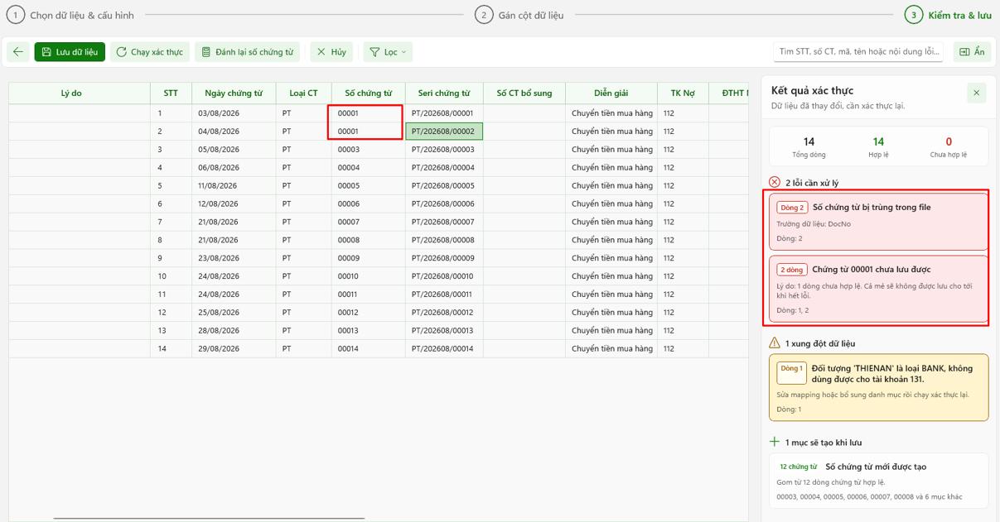

# III. Quy trình import “Bảng kê ngân hàng”

<figure><figcaption></figcaption></figure>

1: Chọn dữ liệu -> 2: Gắn cột dữ liệu -> 3: Kiểm tra &#x26; Lưu



### <mark style="color:$primary;">Bước 1: Chọn dữ liệu & cấu hình</mark>

**Điều kiện để nạp dữ liệu:** Chuẩn hóa dữ liệu file import.

* Chọn loại dữ liệu để hiển thị ra file mẫu import phù hợp với loại import.
* Người dùng tải file mẫu về (<mark style="color:red;">**Alt + M**</mark>), chuẩn hóa lại dữ liệu từng cột trong file dữ liệu đã chuẩn bị sẵn sang các cột tương ứng trong file mẫu đã tải.
* Người dùng có thể không cần chuẩn hóa trước, vẫn có thể import, nhưng sẽ phải gán lại cột dữ liệu tương ứng ở bước **“Gán cột dữ liệu”**. Phần này sẽ mất thời gian để chọn từng loại dữ liệu phù hợp với cột dữ liệu truyền vào.


Khuyến khích việc chuẩn hóa trước file dữ liệu để tiết kiệm thời gian và tránh sai sót thông tin khi bước vào bước **“Gán cột dữ liệu”**.


<figure><figcaption></figcaption></figure>

#### Cấu hình nhanh

<figure><figcaption></figcaption></figure>

* Người dùng cấu hình nhanh loại dữ liệu import vào (<mark style="color:red;">**Alt + C**</mark>).
* Tùy theo loại dữ liệu import vào sẽ có mỗi quy trình khác nhau.

#### Đính kèm file import

Sau khi chuẩn hóa dữ liệu theo file import mẫu, người dùng có thể sử dụng các cách sau để đính kèm file:

* Kéo thả file vào khung import.
* Click nút **“Chọn file”** (<mark style="color:red;">**Alt + E**</mark>) để mở hộp thoại folder, sau đó tìm đến folder chứa file và chọn file đã chuẩn hóa.

Nếu người dùng muốn thay đổi file đã đính, click vào nút **“Chọn file khác”** (<mark style="color:red;">**Alt + E**</mark>).

* Nút tiếp theo: (<mark style="color:red;">**Alt + T**</mark>)
* Nút hủy: (<mark style="color:red;">**ESC**</mark>)

#### Cấu hình chi tiết

**1) Cấu hình chứng từ chung**

<figure><figcaption></figcaption></figure>

* **Tiền tệ:** Chọn loại tiền tệ cho danh sách import.

<figure><figcaption></figcaption></figure>

* **Tỷ giá:** Hiển thị tỷ giá tương với loại tiền tệ đã chọn.
* **Ngân hàng:** Chọn tài khoản ngân hàng tương ứng với file sao kê.


Để chọn được ngân hàng cần chọn, cần phải cấu hình tài khoản ngân hàng.




Vào chức năng **“Danh mục”** ở thanh điều hướng, chọn **“Tài khoản ngân hàng”**.



Chọn “**Tác vụ chung**”



Chọn tài khoản ngân hàng,Click vào tài khoản ngân hàng cần hiển thị



Tick chọn **“Theo dõi hạch toán”** – trạng thái **“Đang theo dõi”**.



<figure><figcaption></figcaption></figure>

**2) Định khoản mặc định**

<figure><figcaption></figcaption></figure>

* **Tiền vào (PT):** Nhập vào TK Có đối ứng hoặc chọn từ danh sách tài khoản kế toán có sẵn.
* **Tiền ra (PC):** Nhập vào TK Nợ đối ứng hoặc chọn từ danh sách tài khoản kế toán có sẵn.
* Hoặc tick chọn tự động định khoản tài khoản đối ứng.

**3) Nguồn dữ liệu số tiền**

<figure><figcaption></figcaption></figure>

**Cách thể hiện số tiền:** Chọn cách thể hiện số tiền tùy theo file mẫu theo mỗi đơn vị

\+ Tiền vào/tiền ra: Chọn khi trong file bảng kê thể hiện rõ các cột tài khoản ngân hàng tiền vào, tiền ra cụ thể (theo file mẫu chuẩn hóa)

\+ Số tiền (+/-): Chọn khi trong file bảng kê nạp vào chỉ hiện một cột tài khoản ngân hàng, cột số tiền (+) tượng trưng cho tiền vào, cột số tiền (-) tượng trưng cho tiền ra, có dấu trừ trước số tiền (theo file nạp dữ liệu chưa chuẩn hóa)

**4) Tự động sinh dữ liệu**

<figure><figcaption></figcaption></figure>

* **Tự động tạo đối tác mới:** Nếu trong file tồn tại đối tác mới, hệ thống sẽ mặc định tự động tạo mới đối tác.



### <mark style="color:$primary;">Bước 2: Gán cột dữ liệu</mark>

<figure><figcaption></figcaption></figure>

Người dùng kiểm tra các cột dữ liệu để import.

Các cột thông tin hiển thị dữ liệu:



**Cột trường thông tin:** Hiển thị các thông tin cần thiết để import vào hệ thống; các trường dữ liệu quan trọng sẽ được đánh dấu sao bắt buộc.



**Cột chứa dữ liệu:** Người dùng chọn thông tin tương ứng với thông tin của “Cột trường thông tin”; các thông tin được chọn là các cột trong file mà hệ thống kiểm tra được.



**Cột dữ liệu mẫu:** Gợi ý mẫu dữ liệu nạp vào theo cột.



**Cột mô tả:** Mô tả ý nghĩa của trường dữ liệu.



Các chức năng:

* Nút tiếp theo: (<mark style="color:red;">**Alt + T**</mark>)
* Nút hủy: (<mark style="color:red;">**ESC**</mark>)
* Quay về bước trước: (<mark style="color:red;">**Alt + Q**</mark>)



### <mark style="color:$primary;">Bước 3: Kiểm tra & lưu</mark>

<figure><figcaption></figcaption></figure>

1. Hiển thị thông tin các trường dữ liệu được nạp vào.
2. Hiển thị kết quả sau khi hệ thống chạy xác thực đối chiếu với dữ liệu trong hệ thống.

<figure><figcaption></figcaption></figure>

Nếu có dữ liệu đã tồn tại hoặc lỗi, hệ thống sẽ hiển thị cảnh báo ở mục kết quả xác thực.

#### Các chức năng trên thanh công cụ

* **Chạy xác thực** (<mark style="color:red;">**F5**</mark>): Người dùng click chọn chức năng để thực hiện kiểm tra, rà soát lại các chứng từ nhập vào xem hợp lệ hay chưa. Nếu chưa, hệ thống sẽ cảnh báo ở bên phải màn hình, mục **“Kết quả xác thực”**.
* **Đánh lại số chứng từ** (<mark style="color:red;">**Alt + R**</mark>): Dùng để đánh lại số chứng từ trong danh sách chứng từ import vào.
* **Lọc** (<mark style="color:red;">**Alt + L**</mark>): Dùng để lọc chứng từ theo các trường hợp: hợp lệ, có lỗi, để hiển thị danh sách các chứng từ theo điều kiện.
* **Hủy** (<mark style="color:red;">**ESC**</mark>): Dùng để thoát khỏi chức năng **“Nạp dữ liệu”**.
* **Tìm** (<mark style="color:red;">**Ctrl + F**</mark>): Tìm chứng từ theo thông tin nhập vào.
* **Lưu dữ liệu** (<mark style="color:red;">**Ctrl + S**</mark>): Thực hiện import danh sách chứng từ vào hệ thống.
* **Quay về bước trước** (<mark style="color:red;">**Alt + Q**</mark>).
* Người dùng có thể chỉnh sửa trực tiếp các thông tin chứng từ trong bảng.


