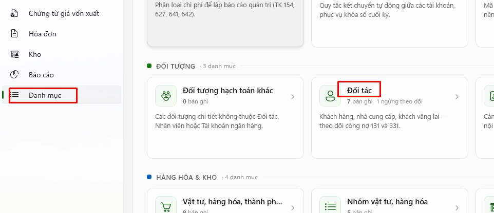
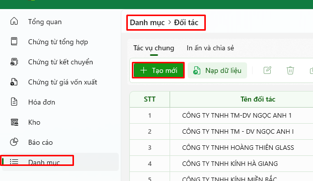
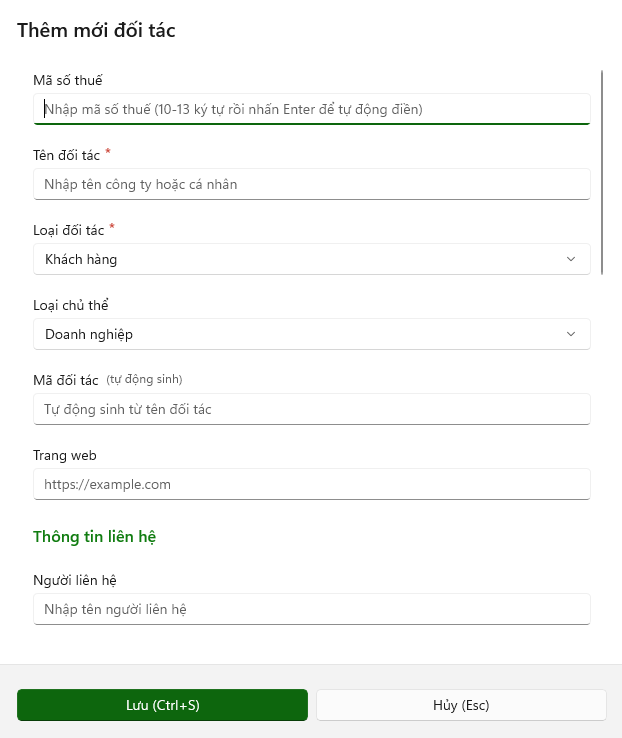
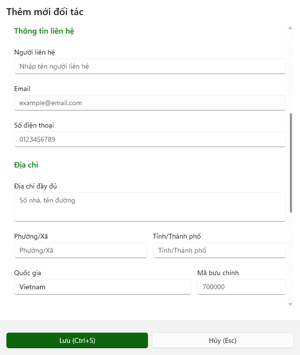
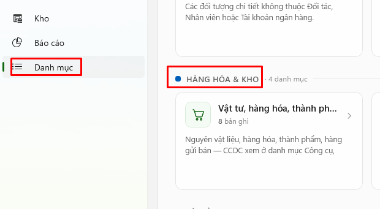
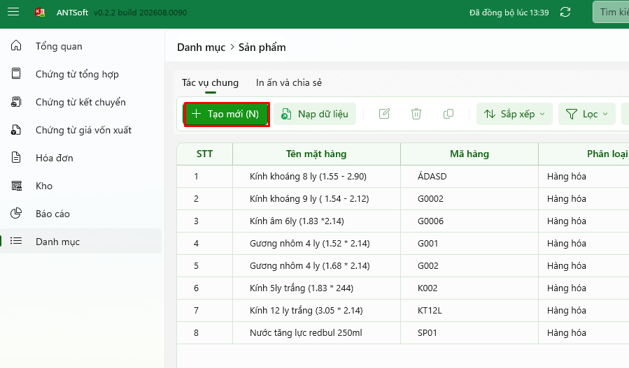
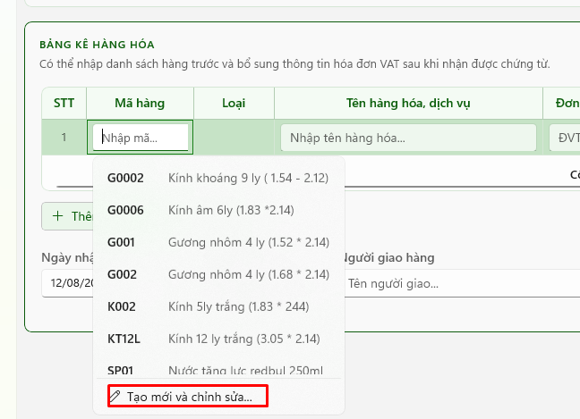
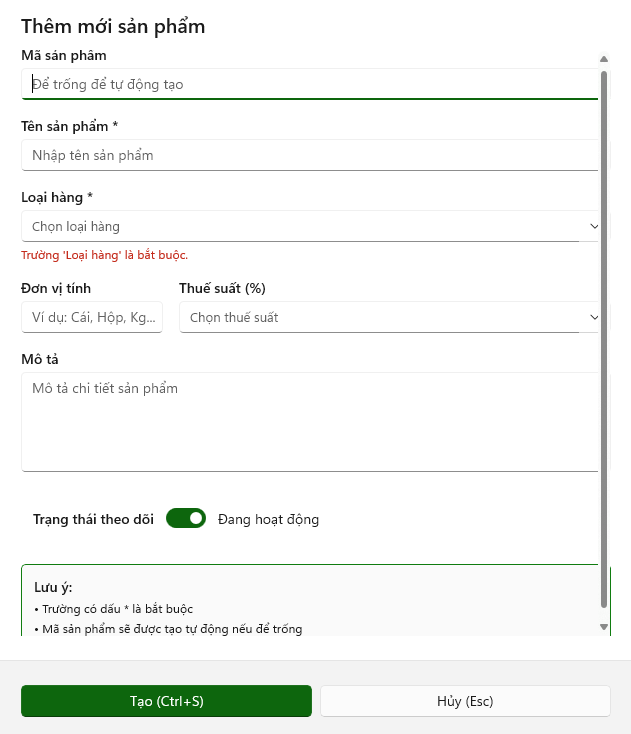

# Các chức năng bổ sung

## <mark style="color:$primary;">Chức năng thêm mới đối tác</mark>

Có 2 cách để thêm mới một đối tác.





**Chọn Danh mục**

Trên thanh menu chọn **Danh mục** (<mark style="color:red;">**Ctrl + 7**</mark>).



**Chọn Đối tác**

Chọn mục **Đối tác**.



**Tạo mới**

Hệ thống hiển thị màn hình đối tác, chọn **Tạo mới** (<mark style="color:red;">**Ctrl + N**</mark>).



**Nhập thông tin**

Hệ thống hiển thị popup **Thêm mới đối tác**, nhập thông tin đối tác cần điền vào popup.



<figure><figcaption></figcaption></figure>

<figure><figcaption></figcaption></figure>





**Chọn Tạo mới và chỉnh sửa**

Tại màn hình nhập mới chứng từ, ở mỗi trường thông tin như mã số thuế trong bảng thông tin hóa đơn hoặc thông tin đối tượng, khách hàng ở các mẫu phiếu, chọn **Tạo mới và chỉnh sửa**.



**Nhập thông tin**

Hệ thống hiển thị popup **Thêm mới đối tác**, nhập thông tin đối tác cần điền vào popup.



<figure><figcaption></figcaption></figure>



<figure><figcaption></figcaption></figure> <figure><figcaption></figcaption></figure>

**Nhóm thông tin đối tác**

* **Mã số thuế:** Nhập vào mã số thuế đối tác. Khi nhập xong bấm Enter để lấy thông tin dựa trên mã số thuế để điền xuống các trường thông tin bên dưới.
* **Tên đối tác** (bắt buộc): Nhập vào hoặc tự động điền khi nhập mã số thuế.
* **Loại đối tác** (bắt buộc): Chọn loại đối tác phù hợp để phân loại khách hàng hoặc nhà cung cấp.
* **Loại chủ thể:** Chọn loại chủ thể để xác định **đối tượng tham gia giao dịch.**
* **Mã đối tác:** Là **mã định danh duy nhất** của một đối tượng giao dịch trong hệ thống.
* **Trang web:** Thông tin trang web công ty đối tác.

**Thông tin liên hệ**

* **Người liên hệ:** Tên người đại diện của đối tác.
* **Email:** Email người đại diện.
* **Số điện thoại:** Số điện thoại người đại diện.

**Địa chỉ của công ty đối tác**

* **Địa chỉ đầy đủ:** Địa chỉ sẽ được tự động điền khi nhập mã số thuế hoặc có thể tự nhập lại địa chỉ chi tiết.
* **Phường/Xã:** Nhập vào địa chỉ phường/xã của đối tác.
* **Tỉnh/thành phố:** Nhập vào địa chỉ tỉnh/thành phố của đối tác.
* **Quốc gia:** Nhập vào quốc gia của đối tác.
* **Mã bưu chính:** Nhập vào mã bưu chính của đối tác.

**Thông tin ngân hàng**

* **Tên ngân hàng:** Nhập vào tên ngân hàng của đối tác.
* **Chi nhánh:** Nhập vào chi nhánh ngân hàng vừa nhập.
* **Số tài khoản:** Nhập vào số tài khoản đối tác.

**Thông tin bổ sung**

* **Ngày thành lập:** Ngày thành lập công ty của đối tác.
* **Trạng thái:** Trạng thái hoạt động của công ty đối tác. Nếu không hoạt động sẽ không hiển thị cho chọn trong thêm mới chứng từ.
* Sau khi nhập xong các thông tin, **Lưu** (<mark style="color:red;">**Ctrl + S**</mark>) hoặc **Hủy** (<mark style="color:red;">**ESC**</mark>).

## <mark style="color:$primary;">Chức năng thêm mới hàng hóa</mark>

Có 2 cách để thêm mới hàng hóa.





**Chọn Danh mục**

Trên thanh menu chọn **Danh mục** (<mark style="color:red;">**Ctrl + 7**</mark>).



**Chọn Vật tư, hàng hóa, thành phẩm**

Chọn mục **Vật tư, hàng hóa, thành phẩm**.



**Tạo mới**

Hệ thống hiển thị màn hình sản phẩm, chọn **Tạo mới** (<mark style="color:red;">**Ctrl + N**</mark>).



**Nhập thông tin**

Hệ thống hiển thị popup **Thêm mới sản phẩm**, nhập thông tin đối tác cần điền vào popup.



<figure><figcaption></figcaption></figure>

<figure><figcaption></figcaption></figure>





**Chọn Tạo mới và chỉnh sửa**

Tại màn hình nhập mới chứng từ, ở trường thông tin mã hàng chọn **Tạo mới và chỉnh sửa**.



**Nhập thông tin**

Hệ thống hiển thị popup **Thêm mới sản phẩm**, nhập thông tin hàng hóa, sản phẩm cần thêm vào popup.



<figure><figcaption></figcaption></figure>



<figure><figcaption></figcaption></figure>

**Thông tin cần điền**

* **Mã sản phẩm:** Nhập vào hoặc để trống sẽ tự động sinh mã sản phẩm.
* **Tên sản phẩm** (bắt buộc): Nhập vào tên sản phẩm, hàng hóa.
* **Loại hàng** (bắt buộc): Chọn loại hàng để phân loại (hàng hóa, vật liệu, thành phẩm, công cụ…).
* **Đơn vị tính:** Đơn vị tính cho sản phẩm (cái, m2, hộp, thùng…).
* **Thuế suất (%):** Thuế GTGT của sản phẩm, hàng hóa.
* **Mô tả:** Mô tả chi tiết về sản phẩm hàng hóa.
* **Trạng thái theo dõi:** Chọn trạng thái của sản phẩm. Nếu không hoạt động sẽ không hiển thị cho chọn sản phẩm trong thêm mới chứng từ.
* **Tạo (**<mark style="color:red;">**Ctrl + S**</mark>**):** Thực hiện tạo, lưu sản phẩm hàng hóa vừa điền thông tin.
* **Hủy (**<mark style="color:red;">**ESC**</mark>**):** Thoát khỏi màn hình thêm mới sản phẩm.
